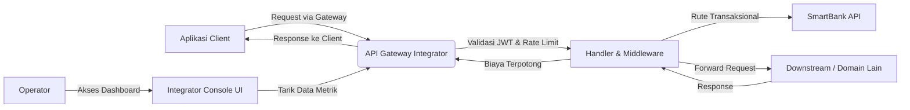

# Dokumentasi Akhir - API Gateway (Integrator)

Dokumen ini berisi seluruh kelengkapan dokumentasi untuk proyek Tugas Besar API Gateway (Integrator).

## 1. Deskripsi Aplikasi
Aplikasi **API Gateway (Integrator)** bertindak sebagai pintu gerbang utama (middleware) yang menjembatani komunikasi antara semua aplikasi domain kelompok lain (Marketplace, Transportasi, dsb) dengan SmartBank. Gateway memastikan semua transaksi moneter tercatat dengan aman dan menarik biaya integrasi (fee) secara otomatis sebelum meneruskan permintaan. Fokus aplikasi ini bukan pada domain spesifik, melainkan pada keandalan rute (routing), validasi (security), perlindungan (circuit breaker & rate limiting), dan monetisasi.

## 2. Use Case / Fitur Utama
Aplikasi ini memiliki 4 fitur wajib dan tambahan fitur console:
- **Routing API**: Meneruskan request antar aplikasi secara transparan, baik secara langsung (`/api/v1/...`) maupun via envelope (`/integrator/routing_api`).
- **Validasi Request**: Memeriksa otentikasi JWT (expired, missing, scope, blacklisted) sebelum meneruskan request.
- **Biaya Layanan Integrasi (Fee)**: Menarik biaya sebesar 0.5% (dibulatkan ke atas) untuk rute transaksional melalui SmartBank.
- **Logging**: Mencatat semua metadata request dan response secara terpusat untuk keperluan audit.
- **Console Dashboard**: Antarmuka web (Frontend) bagi operator Integrator untuk memantau trafik, error rate, performa, dan mengatur konfigurasi rute serta token secara visual.

## 3. Diagram Arsitektur

## 4. Flow Proses (IPO)

### Routing & Validasi Request
| Input | Process | Output |
|---|---|---|
| HTTP Request + JWT | Gateway memvalidasi token, mengecek rate-limit, circuit breaker, dan izin scope. | Diteruskan ke downstream jika valid, atau ditolak (401/403/429). |

### Biaya Layanan (Transactional)
| Input | Process | Output |
|---|---|---|
| HTTP Request Transaksional | Gateway meneruskan ke downstream. Downstream mengembalikan `transaction_amount`. Gateway menghitung fee 0.5% dan memotong saldo dari SmartBank. | HTTP Response ditambahkan field `fee` (status: success/deferred). |

### Logging
| Input | Process | Output |
|---|---|---|
| Metadata request (URL, status, latency) | Middleware mencatat data ke dalam `request_logs`. | Data log dapat ditarik via endpoint `/integrator/logging`. |

## 5. API Endpoint
**Public Integrator (Sesuai `agent.md`)**
| Method | Endpoint | Fungsi |
|---|---|---|
| ANY | `/api/v1/{service}/{feature}` | Transparent Proxy Routing (Forwarding) |
| POST | `/integrator/routing_api` | Envelope Proxy Routing (Forwarding) |
| POST | `/integrator/validasi_request` | Validasi JWT dan mengembalikan scope |
| GET | `/integrator/logging` | Mendapatkan daftar log request gateway |

**Internal Console (Dashboard)**
| Method | Endpoint | Fungsi |
|---|---|---|
| GET | `/api/console/dashboard/metrics` | Mengambil data total request, error rate |
| GET | `/api/console/dashboard/charts` | Mengambil data grafik throughput |
| GET | `/api/console/routes` | Mengambil daftar rute |
| POST | `/api/console/routes` | Menambahkan rute baru |
| GET | `/api/console/tokens` | Mengambil daftar token aktif |
| POST | `/api/console/tokens/revoke` | Mencabut token (blacklist) |

## 6. Integrasi SmartBank
Gateway berkomunikasi dengan SmartBank melalui HTTP Client untuk menarik fee.
- **Mekanisme**: Saat downstream mengembalikan `transaction_amount`, gateway memanggil SmartBank POST `/api/v1/transfer`.
- **Payload**: `{ "amount": <fee_amount>, "recipient": "GATEWAY_REVENUE" }`
- **Idempotency**: Menggunakan key `fee-{request_id}` untuk mencegah double charge jika terjadi retry.
- **Failure**: Jika SmartBank down, fee dicatat sebagai `deferred` (PENDING di DB) dan transaksi utama tetap dikembalikan sukses ke pengguna.

## 7. Desain Database
Terdapat 5 tabel utama dalam SQLite:
- `routes_registry`: Menyimpan konfigurasi rute (`service_name`, `feature_name`, `downstream_url`, `transactional`).
- `request_logs`: Menyimpan history lalu lintas (`request_id`, `method`, `path`, `status_code`, `latency_ms`).
- `gateway_fees`: Menyimpan histori pemotongan fee (`request_id`, `amount`, `status`).
- `jwt_blacklist`: Menyimpan `jti` (JWT ID) token yang telah dicabut sebelum masa berlakunya habis.
- `operators`: Menyimpan kredensial login bagi pengelola console Integrator.

## 8. Mekanisme Transaksi
1. Request masuk dengan header `X-Idempotency-Key` (wajib untuk transaksional).
2. Gateway meneruskan ke domain aplikasi (contoh: POST `/api/v1/marketplace/checkout`).
3. Domain memproses dan membalas dengan JSON yang mengandung `"transaction_amount": 100000`.
4. Gateway mencegat balasan ini, menghitung fee `0.005 * 100000 = 500`.
5. Gateway menagih 500 ke SmartBank.
6. Balasan dimodifikasi: JSON ditambahkan `{ "fee": { "amount": 500, "status": "success" } }` dan dikembalikan ke pemanggil.

## 9. UI Sederhana (Console Integrator)
Aplikasi memiliki UI frontend (Next.js) yang dapat diakses di `http://localhost:3000`.
Halaman utama yang tersedia:
- **Login**: Autentikasi operator Integrator.
- **Dashboard**: Menampilkan metrik utama (Total Requests, Error Rate, Active Routes) dan grafik Traffic History.
- **Routes**: Menampilkan tabel seluruh rute yang terdaftar beserta status Circuit Breaker. Terdapat fitur untuk menambah rute baru.
- **Tokens**: Manajemen JWT Tokens, menampilkan daftar token aktif, fitur untuk Create Token dan Revoke Token.
- **Logs**: Tabel log lalu lintas (request history) yang dapat difilter berdasarkan metode atau rentang waktu.
- **Fees**: Riwayat transaksi fee yang berhasil dipotong (SUCCESS) maupun tertunda (PENDING).

## 10. Skenario Pengujian (Test Scenarios)
Terdapat 15 skenario pengujian utama (GW-T01 - GW-T15) yang diimplementasikan di `airdanapi_BE/internal/handler/gateway_scenarios_test.go`.
Seluruh skenario telah dieksekusi menggunakan `go test -race ./...` dan mendapatkan hasil **PASS**.

| ID | Skenario | Expected Status |
|---|---|---|
| T01 | Read request proxy | 200 OK |
| T02 | Transaksi & potong fee | 200 OK, potong fee sukses |
| T03 | Request tanpa JWT | 401 Unauthorized (`AUTH_TOKEN_MISSING`) |
| T04 | Token kadaluarsa | 401 Unauthorized (`AUTH_INVALID_TOKEN`) |
| T05 | Token di-revoke (blacklist) | 401 Unauthorized (`AUTH_INVALID_TOKEN`) |
| T06 | Rute tidak ditemukan | 404 Not Found (`ROUTE_NOT_FOUND`) |
| T07 | Rate limit tercapai | 429 Too Many Requests (`RATE_LIMITED`) |
| T08 | Idempotency replay (sama key) | 200 OK (Cache dikembalikan) |
| T09 | Idempotency conflict (beda body) | 409 Conflict (`IDEMPOTENCY_CONFLICT`) |
| T10 | Downstream Timeout | 502 Bad Gateway (`UPSTREAM_TIMEOUT`) |
| T11 | Circuit Breaker Terbuka | 503 Service Unavailable (`CIRCUIT_OPEN`) |
| T12 | SmartBank Gagal (Fee Deferred) | 200 OK (Transaksi utama sukses, Fee PENDING) |
| T13 | Akses Ditolak (Beda Scope) | 403 Forbidden (`AUTH_SCOPE_DENIED`) |
| T14 | Tarik Log Integrator | 200 OK (Menampilkan data JSON log) |
| T15 | Concurrency Load Test | 200 OK (Mampu melayani 10 goroutine simultan) |

## 11. Kendala dan Solusi
1. **Kendala**: Menangani respons downstream yang sangat lambat yang bisa menyebabkan bottleneck pada gateway.
   **Solusi**: Menerapkan context timeout pada HTTP Client dan mengaktifkan Circuit Breaker. Jika gagal berkali-kali, circuit terbuka dan langsung mereturn 503 tanpa membebani jaringan.
2. **Kendala**: Integrasi biaya ke SmartBank gagal tapi transaksi downstream sukses.
   **Solusi**: Menerapkan sistem fee deferred (PENDING). Transaksi ke klien tetap dikembalikan sukses, lalu sistem akan mencoba menarik fee lagi di masa depan.
3. **Kendala**: Replay attack / double-charge fee pada aplikasi yang retry otomatis.
   **Solusi**: Mengimplementasikan `X-Idempotency-Key` dengan hashing SHA-256 terhadap request body.

## 12. Dokumentasi Tim
*(Bagian ini wajib diisi oleh pengguna / anggota kelompok)*

| Nama / NIM | Peran / Jobdesc | Kontribusi |
|---|---|---|
| [Nama 1] / [NIM 1] | Backend Developer | [Deskripsi tugas] |
| [Nama 2] / [NIM 2] | Frontend Developer | [Deskripsi tugas] |
| [Nama 3] / [NIM 3] | QA / Tester | [Deskripsi tugas] |
